# Bundled Figure Screenshot Gallery

Use this gallery when the user wants concrete top-journal visual examples for
figure layout, panel ordering, chart density, or study-design schematics. The
images below are cropped JPG assets bundled inside this skill, so they work on
other computers without Zotero access.

Do not copy these panels into a manuscript as final figures. Use them as visual
references for creating original figure layouts, captions, and plotting plans.
Preserve the source DOI and license when an output handoff mentions the visual
reference.

## Portable Asset Rules

- These images are stored in `assets/zotero-figure-examples/` and indexed in
  `assets/zotero-figure-examples/manifest.json`.
- Zotero keys in the manifest are provenance labels only; the skill must not
  require the user's Zotero library at runtime.
- Use only the bundled JPG path when opening or inspecting a reference image.
- If a requested journal or project needs direct reuse of a source figure,
  verify the license again before reuse.

## Embedded References

### figref-01-radimagenet-workflow

- Source: S04, DOI `10.1148/ryai.210315`, `CC BY 4.0`.
- Pattern: dataset curation + pretraining + transfer-learning workflow.

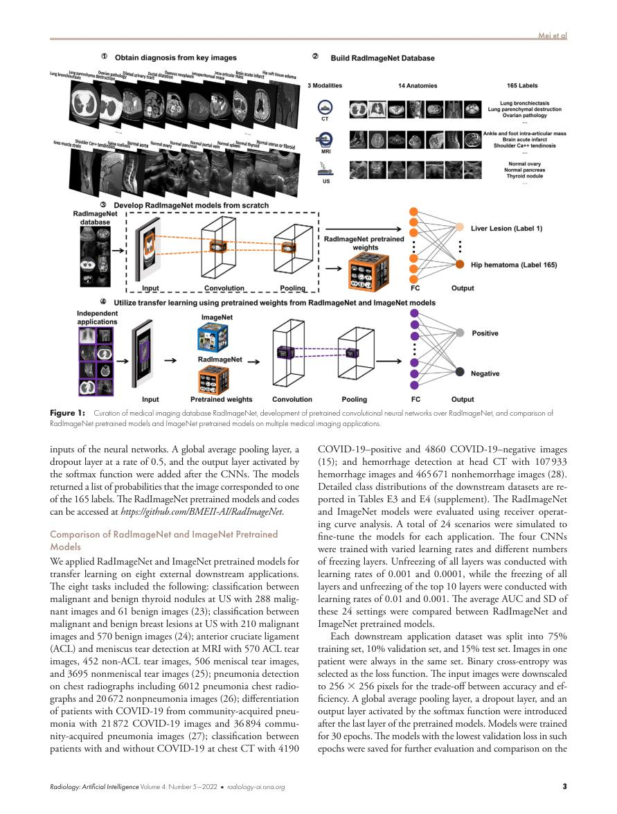

### figref-02-radimagenet-performance

- Source: S04, DOI `10.1148/ryai.210315`, `CC BY 4.0`.
- Pattern: small-dataset performance comparison with uncertainty.

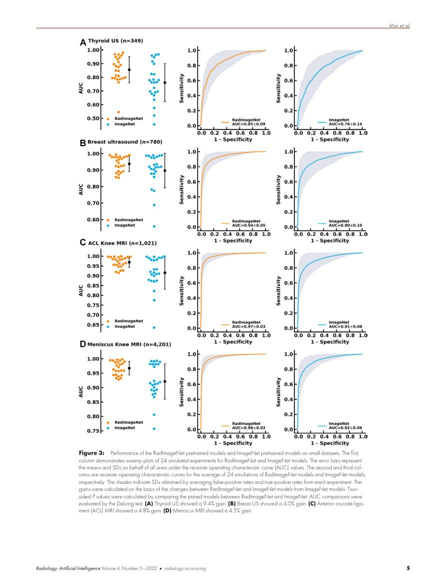

### figref-03-tme-study-design

- Source: S13, DOI `10.1016/j.xcrm.2023.101146`, `CC BY 4.0`.
- Pattern: cohort design with CT/IHC linkage and validation.

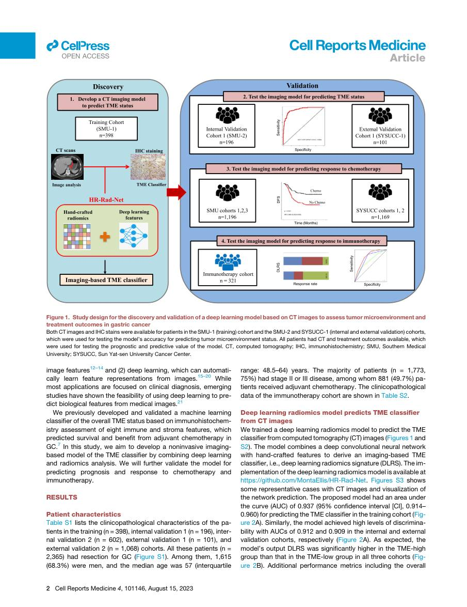

### figref-04-tme-model-performance

- Source: S13, DOI `10.1016/j.xcrm.2023.101146`, `CC BY 4.0`.
- Pattern: ROC/distribution/confusion-matrix performance panel.

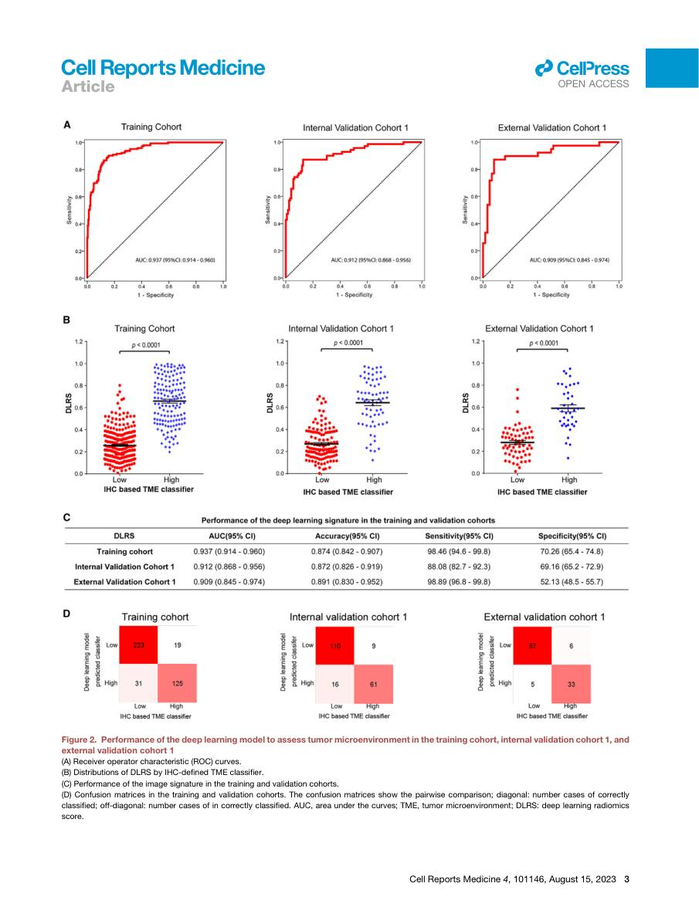

### figref-05-mr-deltanet-design

- Source: S15, DOI `10.1002/advs.202517721`, `CC BY 4.0`.
- Pattern: longitudinal MRI study design and biological interpretation route.

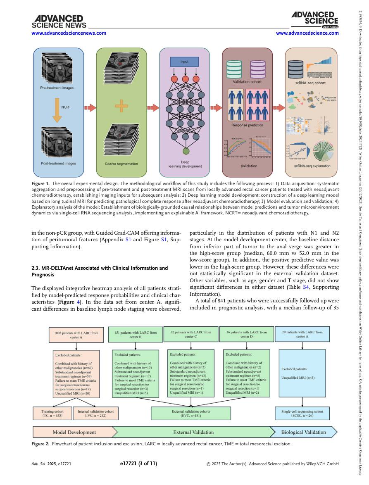

### figref-06-mr-deltanet-performance

- Source: S15, DOI `10.1002/advs.202517721`, `CC BY 4.0`.
- Pattern: multi-cohort ROC and score-distribution validation.

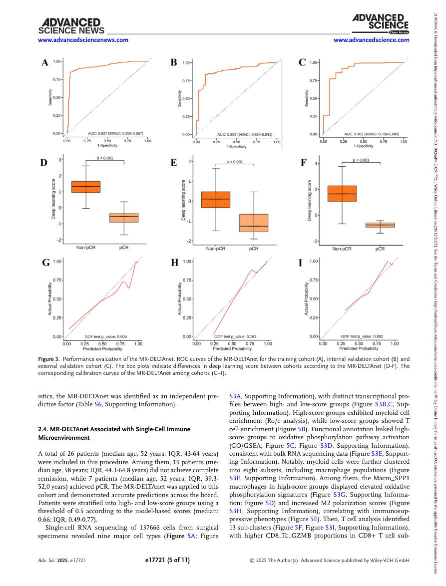

### figref-07-flare-overall-design

- Source: S16, DOI `10.1002/advs.202510931`, `CC BY 4.0`.
- Pattern: multimodal missing-modality foundation-model design.

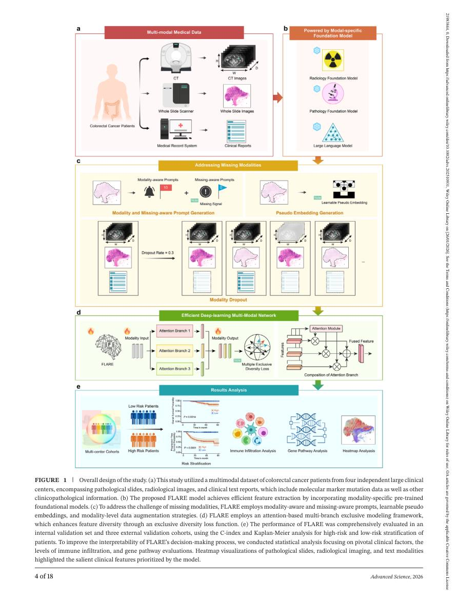

### figref-08-flare-framework

- Source: S16, DOI `10.1002/advs.202510931`, `CC BY 4.0`.
- Pattern: multi-branch model framework with modality-specific encoders.

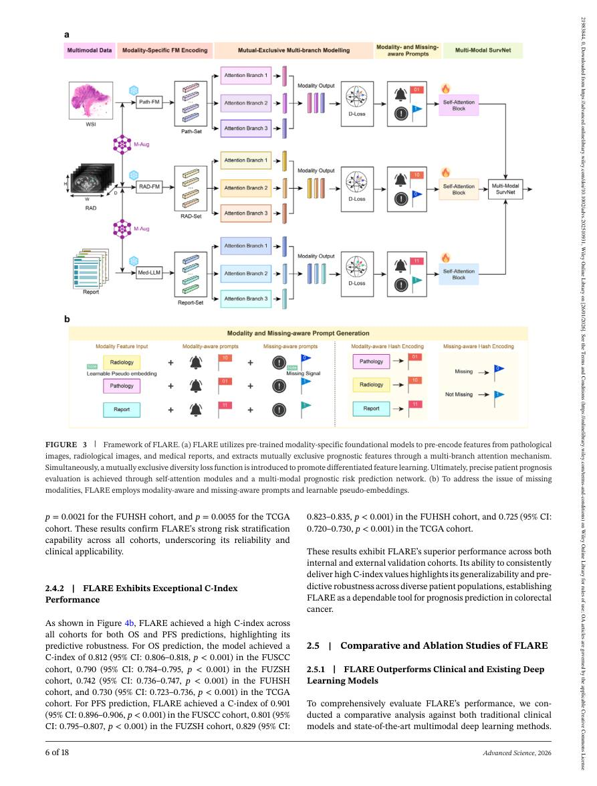

### figref-09-crcfound-overview

- Source: S17, DOI `10.1002/advs.202407339`, `CC BY 4.0`.
- Pattern: 3D CT foundation-model pretraining and downstream tasks.

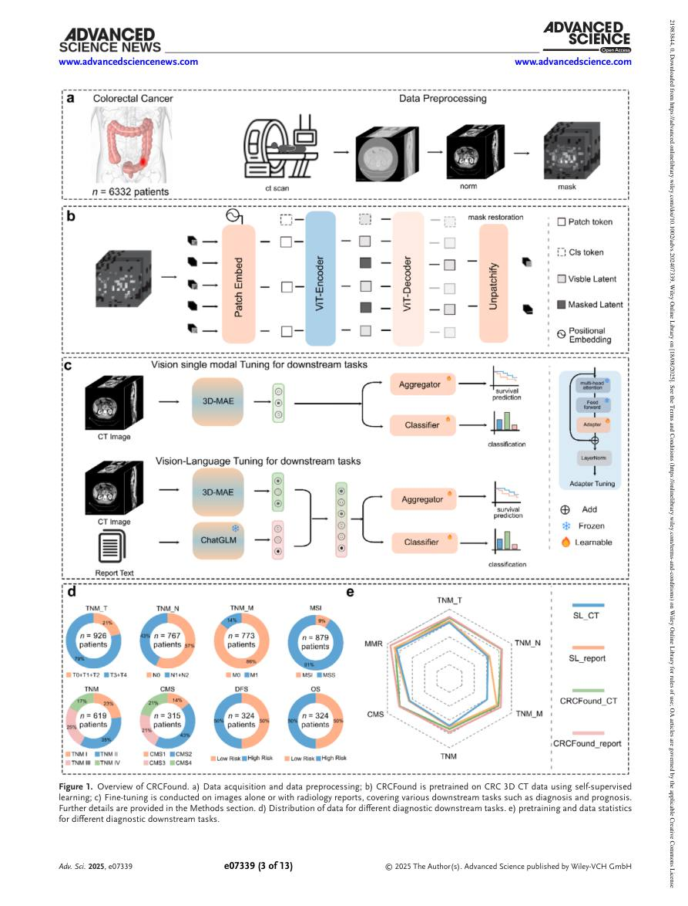

### figref-10-crcfound-performance

- Source: S17, DOI `10.1002/advs.202407339`, `CC BY 4.0`.
- Pattern: cross-validation performance bars plus ROC comparison.

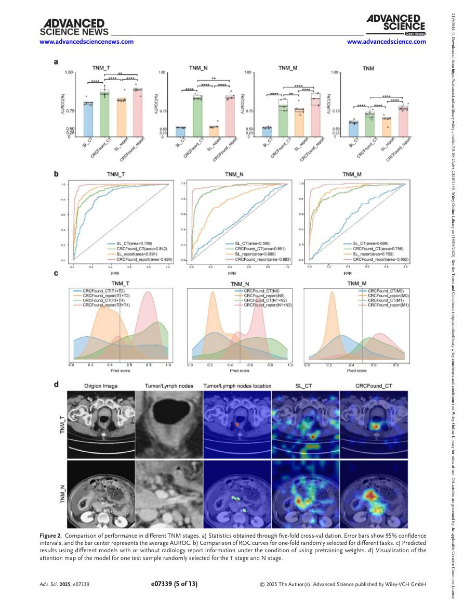

### figref-11-lung-pathology-subtyping

- Source: S26, DOI `10.1016/j.xcrm.2024.101697`, `CC BY 4.0`.
- Pattern: diagnostic downstream algorithm development and validation.

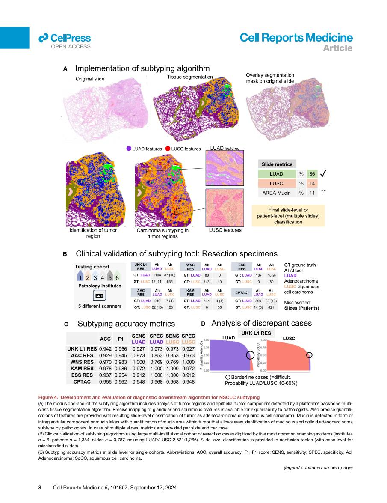

### figref-12-lung-pathology-prognostic

- Source: S26, DOI `10.1016/j.xcrm.2024.101697`, `CC BY 4.0`.
- Pattern: AI-derived prognostic parameter quantification with visual examples.

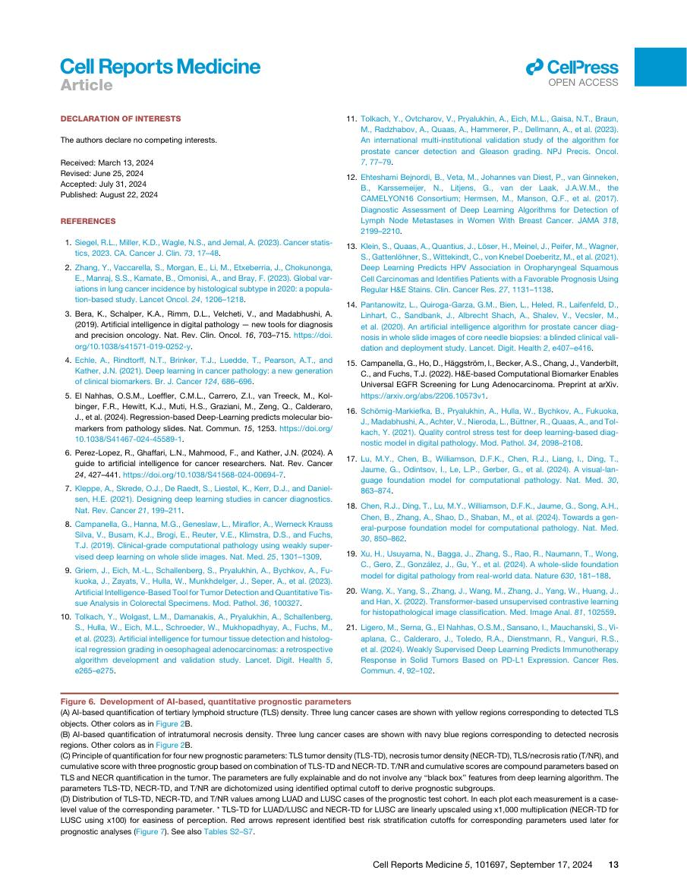
