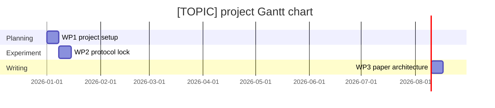

# Research Planning Output Template

## Template Language and Editing Rule

This template defines structure, not output language. Translate headings, field labels, and explanatory text into the user's language in the final report. Keep file paths, citation keys, variable names, method names, model names, trial IDs, and dataset names in their original form when appropriate.

Do not leave empty placeholder rows in the final report. If information is missing, mark it as `missing`, `uncertain`, or `provisional` and explain the consequence.

```markdown
# [TOPIC] Research Plan

## 1. Basic Information

- Topic / research question:
- Target output:
- Discipline / project type:
- Planning maturity level:
- Time window:
- Available materials / data:
- Upstream evidence used:
- Plan status: confirmed / provisional
- Generated date:

## 2. Current State Assessment

| Item | Current state | Evidence / source | Consequence for planning |
|---|---|---|---|
| Research question |  |  |  |
| Hypothesis / claim |  |  |  |
| Literature base |  |  |  |
| Data / materials |  |  |  |
| Method readiness |  |  |  |
| Output target |  |  |  |

## 3. Scope and Boundary

### In Scope
- 

### Out of Scope
- 

### Assumptions
- 

## 4. Research Objective and Success Criteria

- Primary objective:
- Secondary objectives:
- Success criteria:
- Minimum viable deliverable:

## 5. Work Packages

| WP | Work package | Goal | Inputs | Method / activities | Deliverable | Dependencies | Quality gate |
|---|---|---|---|---|---|---|---|
| WP1 |  |  |  |  |  |  |  |
| WP2 |  |  |  |  |  |  |  |
| WP3 |  |  |  |  |  |  |  |

## 6. Dependency Map

```text
WP1 -> WP2 -> WP3
```

Parallelizable tasks:
- 

Blocking tasks:
- 

## 7. Timeline and Milestones

| Phase | Time window | Main tasks | Milestone | Deliverable | Exit condition |
|---|---|---|---|---|---|
| Phase 1 |  |  |  |  |  |
| Phase 2 |  |  |  |  |  |
| Phase 3 |  |  |  |  |  |

## 8. Gantt Chart

Use Mermaid `gantt` when possible.



If exact dates are unknown, use week labels in a compact table:

| Work package | W1 | W2 | W3 | W4 | W5 | W6 | Milestone |
|---|---|---|---|---|---|---|---|
| WP1 |  |  |  |  |  |  |  |

## 9. Risk and Fallback Plan

| Risk | Probability | Impact | Warning signal | Mitigation | Fallback |
|---|---|---|---|---|---|
|  |  |  |  |  |  |

## 10. Quality Gates

| Gate | Pass / fail / provisional | Reason | Required action |
|---|---|---|---|
| Question-specific |  |  |  |
| Evidence-grounded |  |  |  |
| Data/material feasible |  |  |  |
| Method fit |  |  |  |
| Timeline realistic |  |  |  |
| Ethics/privacy/licensing |  |  |  |
| Deliverables concrete |  |  |  |

## 11. Next 3 Actions

1. 
2. 
3. 

## 12. Downstream Handoff

- If method choices remain open: hand off to `nnscholar2-2-ars-plan`.
- If manuscript structure is the next bottleneck: hand off to `nnscholar2-3-paper-architecture`.
- If the user needs detailed experimental workflow / technical route: hand off to `nnscholar2-2-ars-plan`.

## 13. Source Notes

| Source | How it was used | Limitation |
|---|---|---|
|  |  |  |
```
