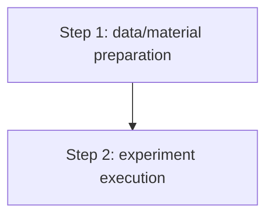

# NNScholar 2.2 Experimental ARS and Validation Plan

This workflow is the central experimental design authority for NNScholar.

It answers one large question:

```text
How exactly will the study or experiment be done, how will it be validated,
what result pattern is expected, what would disconfirm it, and is the route
feasible enough to proceed?
```

2.2 natively includes experimental flowcharts, technical routes, study flows,
and model/evaluation pipelines.

3.1 is active again as the execution layer. Use
`nnscholar3-1-experiment-validation-plan` after 2.2 when the user wants to
execute, monitor, resume, audit, or iteratively improve the locked protocol.

Use 2.2 for requests such as:

- experiment protocol;
- ARS plan;
- technical route;
- experimental flowchart;
- step-by-step experiment plan;
- expected results and disconfirming results;
- feasibility or resource audit;
- validation plan;
- pilot experiment;
- go/no-go criteria;
- fallback route if the experiment fails.

Use `nnscholar2-1-research-planning` only for project plan, work packages, timeline, and Gantt chart.
Use `nnscholar2-3-paper-architecture` only for manuscript structure, section planning, result storyline, and figure/table blueprint.

Version: `0.3.0`. Stage: `research setting / experimental protocol and validation`. Routed through `$nnscholar-research-suite`.

## NNScholar Unified Operating Standard

### Naming and Invocation

- Keep the workflow id as `nnscholar2-2-ars-plan` / `/nnscholar2-2-ars-plan`.
- Keep the title format as `NNScholar 2.2 Experimental ARS and Validation Plan`.
- Name generated folders and files with English ASCII kebab-case slugs.

### Input and Language Policy

- Accept user input, upstream NNScholar outputs, local files, pasted tables, figures, protocols, reviewer comments, datasets, code manifests, and target-output constraints.
- For planning, experiment, validation, audit, and author-facing notes: output in the user's input language unless the user requests another language.
- For manuscript-facing text: default to polished academic English unless the user or venue requests otherwise.
- Preserve identifiers in their standard form: DOI/PMID/arXiv IDs, gene/protein symbols, datasets, benchmarks, model names, endpoints, metrics, scales, trial IDs, software names, and file paths.
- Do not fabricate citations, ethics approvals, registrations, sample sizes, statistics, datasets, model results, author declarations, or venue requirements.

## Core Rule

2.2 defines the experimental and validation contract. Downstream workflows must not silently change:

- research question or primary hypothesis;
- study object, sample, corpus, or dataset;
- exposure/intervention/method;
- comparator/control/baseline;
- primary endpoint or metric;
- analysis method;
- validation route;
- quality gates and claim boundary.

If these must change, reopen 2.2.

Do not produce a locked protocol when key design or feasibility information is missing. Produce a provisional scheme, list blockers, and state what must be verified.

## ARS Meaning

- `Aim`: research objective, question, hypothesis, success criteria, and falsification criteria.
- `Route`: executable study/experiment/computation path, technical route, flowchart, and validation route.
- `Specification`: samples/materials/data, variables, endpoints, methods, resources, analysis plan, expected and disconfirming results, bias control, pilot, go/no-go criteria, fallback plan, and protocol lock.

## Run Modes

| Mode | Trigger | Behavior |
|---|---|---|
| `linked` | Matching 1.1-1.4 or 2.1 outputs exist | Fuse upstream evidence and create the experimental/validation scheme |
| `partial` | Some upstream evidence exists | Build a provisional scheme plus evidence/resource gap table |
| `scratch` | No matching upstream evidence exists | Ask minimal intake questions and create a provisional scheme |
| `revision` | User rejects or revises part of the route | Update the protocol while preserving unchanged locked decisions |

If the user only clicks the button or gives a vague request, ask only:

1. What research question, hypothesis, or claim should be tested?
2. What data, samples, materials, experiments, literature table, code, or knowledge base is available?
3. What is the target output: paper, proposal, thesis, protocol, grant, algorithm benchmark, or internal scheme?

## Upstream Evidence Priority

Use upstream artifacts in this order:

1. `nnscholar1-3-hypothesis-generation`: locked/provisional hypothesis, mechanism, prediction, falsification rule.
2. `nnscholar1-2-literature-searching`: evidence base, method precedents, endpoints, controversies, comparison studies.
3. `nnscholar1-1-question-mining`: primary question, secondary questions, novelty rationale, scope.
4. `nnscholar1-4-domain-expert-knowledge-base`: terminology, domain constraints, known risks, reviewer concerns.
5. `nnscholar2-1-research-planning`: timeline, resources, milestones, bottlenecks.
6. Current user message: latest active intent and constraints.

When exact files are not provided, search the workspace by skill id, topic keywords, disease/model/dataset, date, and report headings. If multiple plausible bundles exist, show the top 1-3 choices and ask the user to confirm.

## Workflow

### Step 1: Intake and Evidence Map

Extract or ask for:

- research object and target output;
- primary question or hypothesis;
- available upstream reports and local materials;
- data/sample/material/corpus status;
- discipline and scheme type;
- design constraints;
- ethics/privacy/licensing/safety constraints;
- resource constraints: sample size, cases, batches, compute, equipment, software, collaborators, budget, and timeline.

Return a compact intake card before drafting a long scheme.

### Step 2: Select Scheme Family

Choose the scheme family before filling details:

- clinical or epidemiological study;
- basic/translational experiment;
- computational or AI benchmark;
- systematic review/meta-analysis;
- qualitative/social science study;
- theoretical/modeling study;
- engineering or design-science validation;
- mixed-methods project.

If unclear, ask one question or propose 2-3 candidate routes with rejection criteria.

### Step 3: Build ARS

Build:

- `Aim`: objective, question, hypothesis, success criteria, falsification criteria.
- `Route`: design, population/materials/corpus, comparison/control, timeline logic, technical route, experimental flowchart, and validation route.
- `Specification`: eligibility, variables, endpoints, methods, analysis plan, resources, quality controls, bias controls, expected results, disconfirming results, pilot, go/no-go criteria, fallback, and lock card.

Required output scope for full reports:

- experimental aim and claim boundary;
- step-by-step experimental route;
- Mermaid experimental flowchart;
- step table: what to do, input, operation, output, quality gate, failure handling;
- expected results and disconfirming results;
- minimum feasible, standard, and ideal validation routes;
- resource/feasibility audit;
- pilot plan;
- go/no-go criteria;
- fallback plan;
- bias/leakage/confounding/batch-effect/evaluator-risk controls;
- protocol lock card.

### Step 4: Validation Route Selection

Generate 2-3 validation routes:

- `A. Minimum feasible validation`: smallest credible test that can expose fatal failure.
- `B. Standard validation`: default publishable or benchmark-ready route if resources allow.
- `C. Ideal validation`: stronger route with external validation, replication, adjudication, or broader robustness checks.

For each route include:

- required resources;
- core steps;
- expected result if the hypothesis is supported;
- disconfirming result;
- feasibility score from 1-5;
- biggest risk.

Recommend one route and explain why.

### Step 5: Feasibility and Quality Gates

Audit:

| Gate | Question |
|---|---|
| Aim gate | Is the question specific and testable? |
| Evidence gate | Is the scheme grounded in upstream evidence or marked provisional? |
| Data/material gate | Are samples, datasets, materials, corpora, or cases actually available? |
| Resource gate | Are required equipment, software, compute, staff, access, budget, and timeline realistic? |
| Method gate | Does the method answer the question? |
| Measurement gate | Are exposure/intervention/grouping and outcomes measurable? |
| Analysis gate | Are statistics, experiments, or benchmarks compatible with data scale? |
| Bias gate | Are confounding, selection, information, leakage, batch, center, or evaluator biases controlled? |
| Ethics gate | Are IRB, privacy, consent, licensing, and safety needs surfaced? |
| Flowchart gate | Is the experimental flowchart executable and faithful to the protocol? |
| Expected-results gate | Are expected results stated as targets rather than fabricated findings? |
| Validation gate | Is the selected validation route sufficient for the claim? |
| Pilot gate | Can a small pilot detect fatal design/resource problems early? |
| Go/no-go gate | Are continuation, revision, and stop criteria objective? |
| Lock gate | Is the scheme stable enough for downstream 2.3 paper architecture? |

If any critical gate fails, do not lock the protocol.

### Step 6: Output and Handoff

For short chats, return:

- upstream status;
- ARS card;
- route summary or flowchart;
- step-by-step experiment table;
- expected and disconfirming results;
- validation route recommendation;
- feasibility/resource audit;
- pilot plan;
- go/no-go criteria;
- fallback plan;
- unresolved gates;
- next 3 actions.

For full reports, use `references/ars-plan-output-template.md`. Localize headings to the user's language while preserving technical terms, model names, data fields, trial IDs, citations, and file paths.

## Protocol Lock Rule

Only mark `Protocol status: locked` when:

- the user confirms the scheme;
- key variables, endpoints, data/materials, methods, resources, and validation route are specified;
- major risks have mitigation;
- pilot/go-no-go logic is clear;
- downstream paper architecture can safely rely on the scheme.

Otherwise mark `Protocol status: provisional` and list exact blockers.

## Experimental Flowchart Rules

Use conservative Mermaid syntax by default:



Rules:

- Use ASCII node IDs only.
- Put visible labels in quoted brackets.
- Make each node an executable experimental action, not a broad research aspiration.
- Include decision or quality-control gates when they determine whether a step can proceed.
- Do not mix literature review, hypothesis generation, manuscript writing, or submission tasks into the experimental flowchart.
- Arrows indicate execution order or dependency, not causal proof.
- If writing to a file, validate Mermaid with `scripts/validate_mermaid.py` when available.

## Discipline-Specific Guardrails

- Clinical medicine: define index date, population, exposure, comparator, endpoint, time window, adjudication, confounding, missingness, and ethics.
- Basic biomedicine: define model, perturbation, dose/time, controls, readouts, biological replicates, rescue/validation logic.
- AI/data science: define dataset, labels, split, baseline, metric, ablation, external test, leakage checks, compute constraints, and reproducibility package.
- Materials/chemistry: define synthesis route, composition, characterization, performance test, comparator, batch repeatability, and stability.
- Education/psychology: define constructs, validated scales, intervention, randomization/quasi-experiment, pre/post measurement, and attrition.
- Economics/social science: define identification strategy, treatment/exposure, outcome, data source, confounders, and robustness tests.
- Humanities: define corpus/archive, selection logic, interpretive framework, counter-evidence, comparison cases, and source criticism.
- Engineering: define prototype/system, inputs, operating conditions, performance metrics, stress/failure tests, and safety constraints.

## Supervisor Guardrail Integration

For AI/data-science, database, systems, ML, NLP, benchmark/evaluation, or
technical CS protocols, read
`../../references/supervisor-research-guardrails.md` during Step 5. Apply the
Idea Evaluation Gate to feasibility and fatal flaws, the Benchmark Paper Gate to
benchmark/evaluation protocols, and the AI Collaboration Integrity Gate when
the route uses AI-assisted coding, plotting, or writing. Add unresolved
CRITICAL issues to the protocol lock blockers; do not mark the protocol locked
while they remain.

For ML/LLM/RAG/agent/training/evaluation projects, also read
`../../references/ai-research-engineering-guardrails.md` during Steps 3-5. Add
the Two-Loop Research Cycle, Experiment Protocol and Trajectory Gate, Skill
Routing and Environment Gate, and Evaluation Harness Gate as applicable. A
protocol cannot be locked until baseline, benchmark settings, config/seed,
hardware/software environment, artifact paths, and sanity checks are specified
or explicitly marked `needs verification`.

## Non-goals

Do not:

- redo full literature search unless the user asks to return to `nnscholar1-2-literature-searching`;
- invent a hypothesis when 1.3 is missing;
- write manuscript prose;
- fabricate sample sizes, approvals, datasets, citations, or results;
- accept unrealistic methods or timelines without flagging feasibility risk;
- produce a Gantt chart; use 2.1 for project scheduling;
- design manuscript section order or journal storyline; use 2.3 for paper architecture;
- execute, monitor, resume, or audit experiments; use 3.1 for automated research execution after this protocol is ready.
