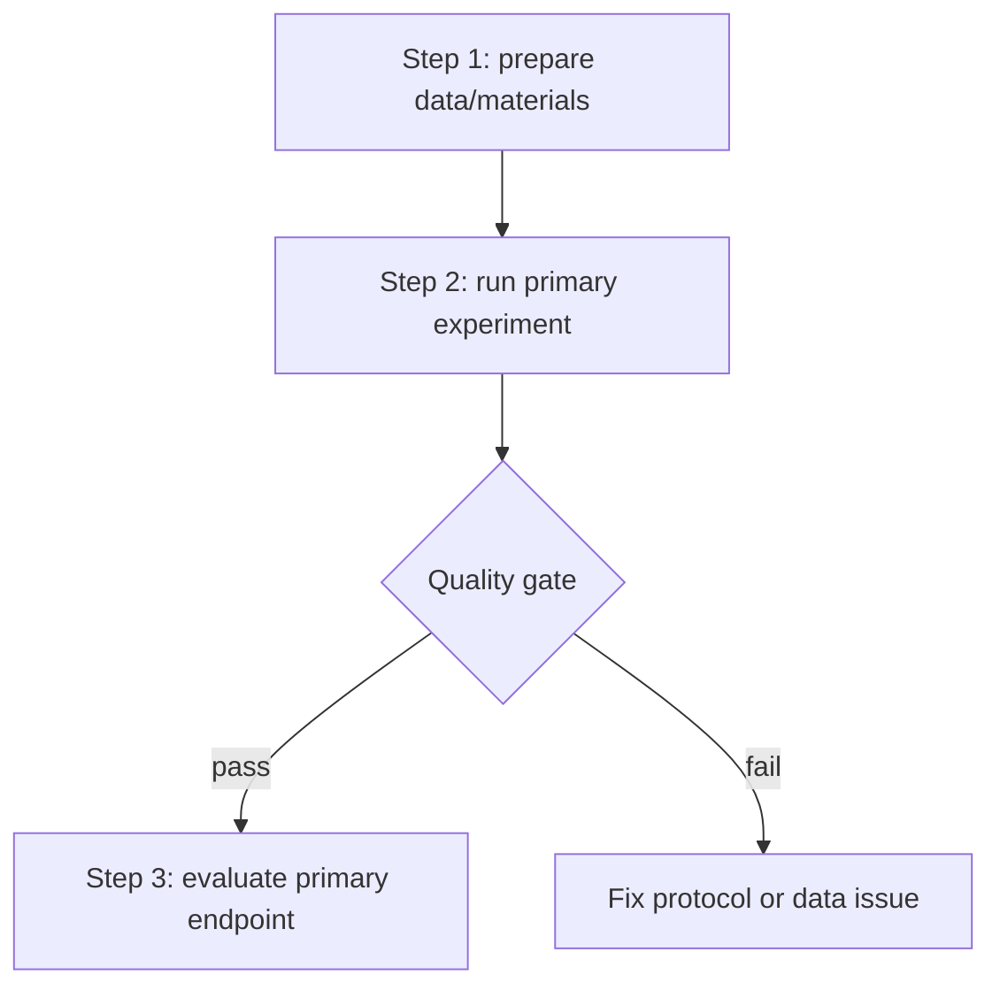

# ARS Plan Output Template

This template defines structure, not output language. Translate headings and field labels to the user's language. Keep technical terms, datasets, model names, variable names, file paths, trial IDs, and citation keys in their original form when appropriate.

Delete empty placeholder rows in the final output. Mark missing information as `missing`, `uncertain`, or `provisional`.

```markdown
# [TOPIC] Experimental ARS and Validation Scheme

## 1. Scheme Status

- Protocol status: provisional / ready for confirmation / locked
- Run mode: linked / partial / scratch
- Target output:
- Discipline / scheme family:
- Active user intent:
- Upstream evidence used:
- Generated date:

## 2. Upstream Evidence Map

| Source | Status | Key extracted content | How it shapes the scheme | Limitations |
|---|---|---|---|---|
| 1.1 Question mining |  |  |  |  |
| 1.2 Literature searching |  |  |  |  |
| 1.3 Hypothesis generation |  |  |  |  |
| 1.4 Domain knowledge base |  |  |  |  |
| 2.1 Research planning |  |  |  |  |
| Current user input |  |  |  |  |

## 3. ARS Card

- Aim:
- Experimental route:
- Specification:
- Main blocker:
- Next decision:

## 4. Aim

- Primary research question:
- Hypothesis / claim:
- Secondary questions:
- Success criteria:
- Falsification criteria:

## 5. Experimental Route

- Study / project design:
- Population, sample, material, corpus, or dataset:
- Comparison, control, baseline, or grouping:
- Technical / experimental route:

```text
[route step 1] -> [route step 2] -> [route step 3]
```

## 6. Experimental Flowchart

Use Mermaid `flowchart` when possible. Nodes must be executable experimental actions.



## 7. Step-by-Step Experimental Procedure

| Step | What to do | Input | Operation / method | Output | Quality gate | Failure handling |
|---|---|---|---|---|---|---|
| 1 |  |  |  |  |  |  |
| 2 |  |  |  |  |  |  |
| 3 |  |  |  |  |  |  |

## 8. Expected Results

These are expected or target results, not observed findings unless real data are provided.

| Experiment / analysis block | Expected result pattern | Disconfirming result pattern | Supports which aim/hypothesis | Planned display after results exist |
|---|---|---|---|---|
| Primary experiment |  |  |  |  |
| Secondary experiment |  |  |  |  |
| Robustness / ablation |  |  |  |  |

## 9. Validation Route Options

| Route | Required resources | Core steps | Expected supporting result | Disconfirming result | Feasibility score 1-5 | Biggest risk |
|---|---|---|---|---|---:|---|
| A. Minimum feasible validation |  |  |  |  |  |  |
| B. Standard validation |  |  |  |  |  |  |
| C. Ideal validation |  |  |  |  |  |  |

Recommended route:

- Recommended route:
- Reason:
- Claim boundary if only the minimum feasible route can be done:

## 10. Resource and Feasibility Audit

| Resource / constraint | Current status | Required for selected route | Gap | Mitigation or confirmation needed |
|---|---|---|---|---|
| Data / samples / materials / corpus |  |  |  |  |
| Sample size / cases / batches / observations |  |  |  |  |
| Equipment / software / compute / database access |  |  |  |  |
| Control / comparator / baseline |  |  |  |  |
| Ethics / privacy / safety / licensing |  |  |  |  |
| Budget / timeline / collaborators |  |  |  |  |

## 11. Pilot Plan

| Pilot component | Minimum action | Success criterion | Failure signal | Decision after pilot |
|---|---|---|---|---|
| Data/material readiness |  |  |  |  |
| Method execution |  |  |  |  |
| Measurement/endpoint calculation |  |  |  |  |
| Bias/leakage/quality-control check |  |  |  |  |

## 12. Go/No-Go Criteria

| Decision | Criterion | Action |
|---|---|---|
| Go |  | proceed to full selected validation route |
| Revise |  | reopen 2.2 and revise route/specification |
| No-go |  | stop or downgrade to feasibility-only report |

## 13. Fallback Plan

| Failure scenario | Trigger | Fallback route | Claim boundary after fallback |
|---|---|---|---|
|  |  |  |  |

## 14. Specification

### Objects and Eligibility

- Inclusion criteria:
- Exclusion criteria:
- Unit of analysis:
- Time window:

### Variables / Constructs / Measurements

| Role | Name | Definition | Measurement/source | Status |
|---|---|---|---|---|
| Exposure/intervention/group |  |  |  |  |
| Primary outcome/metric |  |  |  |  |
| Secondary outcome/metric |  |  |  |  |
| Covariate/control |  |  |  |  |

### Method / Analysis Plan

- Primary method:
- Secondary method:
- Sensitivity / robustness checks:
- Missing data / failed experiment handling:
- Software, tool, or model requirements:

## 15. Bias, Risk, and Mitigation

| Risk | Source | Impact | Mitigation | Fallback |
|---|---|---|---|---|
|  |  |  |  |  |

## 16. Quality Gates

| Gate | Status | Reason | Required action |
|---|---|---|---|
| Aim gate | pass / provisional / fail |  |  |
| Evidence gate | pass / provisional / fail |  |  |
| Data/material gate | pass / provisional / fail |  |  |
| Method gate | pass / provisional / fail |  |  |
| Measurement gate | pass / provisional / fail |  |  |
| Analysis gate | pass / provisional / fail |  |  |
| Bias gate | pass / provisional / fail |  |  |
| Ethics gate | pass / provisional / fail |  |  |
| Flowchart gate | pass / provisional / fail |  |  |
| Expected-results gate | pass / provisional / fail |  |  |
| Validation gate | pass / provisional / fail |  |  |
| Resource gate | pass / provisional / fail |  |  |
| Feasibility gate | pass / provisional / fail |  |  |
| Pilot gate | pass / provisional / fail |  |  |
| Go/no-go gate | pass / provisional / fail |  |  |
| Lock gate | pass / provisional / fail |  |  |

## 17. Protocol Lock Card

- Lock decision: locked / not locked
- Lock blockers:
- Items that downstream skills must not change:
- Items allowed to evolve:
- User confirmation needed:

## 18. Next 3 Actions

1. 
2. 
3. 

## 19. Handoff

- To `nnscholar2-3-paper-architecture` when manuscript structure is next.
- Stay in `nnscholar2-2-ars-plan` when experimental flowchart or route design needs revision.
- Back to `nnscholar1-2-literature-searching` when evidence is too weak.
- Back to `nnscholar1-3-hypothesis-generation` when the hypothesis is not testable.
```
