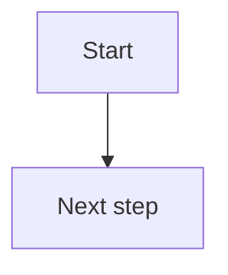

# Flowchart Output Template

This template defines structure, not output language. Translate headings and field labels into the user's language. Keep technical terms, datasets, variables, endpoints, model names, trial IDs, citation keys, and file paths in their original form.

```markdown
# [TOPIC] Flowchart Design

## 1. Diagram Status

- Status: provisional / ready to render
- Run mode: protocol-linked / paper-linked / planning-linked / upstream-linked / scratch
- Diagram type:
- Target use:
- Upstream source:
- Protocol dependency:
- Generated date:

## 2. Diagram Card

- Visual question:
- Reader takeaway:
- Main entities:
- Main arrow meaning:
- Must not imply:
- Main blocker:

## 3. Blueprint

| Component | Content | Notes |
|---|---|---|
| Node groups / swimlanes |  |  |
| Required nodes |  |  |
| Decision points |  |  |
| Edge labels |  |  |
| Legend |  |  |
| Caption focus |  |  |

## 4. Mermaid Diagram



## 5. Caption Draft

Figure 1. 

## 6. Design Checks

| Check | Status | Note |
|---|---|---|
| Protocol consistency | pass / provisional / fail |  |
| Arrow semantics | pass / provisional / fail |  |
| Mermaid safety | pass / provisional / fail |  |
| Detail level | pass / provisional / fail |  |
| Claim boundary | pass / provisional / fail |  |

## 7. Revision Questions

1. 
2. 
3. 
```
