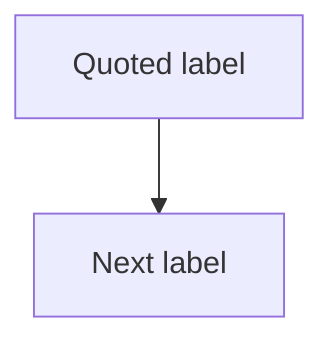

# Mermaid Style Guide

Use this guide to generate Mermaid diagrams that are detailed, clean, and unlikely to break.

## Safe Defaults

Prefer:



Use:

- `flowchart TD` for top-to-bottom workflows.
- `flowchart LR` for pipelines or left-to-right routes.
- quoted labels in square brackets for all visible nodes.
- ASCII node IDs.
- subgraphs for major phases.

## Node IDs

Good:

```mermaid
A1["患者筛选"]
DATA2["Data extraction"]
ANALYSIS3["Cox regression"]
```

Avoid:

```mermaid
患者筛选["患者筛选"]
PD-L1(High)["PD-L1 High"]
analysis/result["analysis/result"]
```

## Labels

Always quote labels:

```mermaid
A1["PD-L1 high expression<br/>TPS >= 50%"]
```

Prefer `<br/>` for line breaks. Keep labels short. If a node needs more than 2 lines, split it into two nodes.

## Edges

Use simple arrows:

```mermaid
A1 --> A2
A2 -->|eligible| A3
A2 -->|excluded| X1
```

Avoid dense edge labels. If labels contain Chinese or punctuation, keep them short:

```mermaid
A2 -->|"纳入"| A3
```

## Subgraphs

Use ASCII subgraph IDs and quoted visible titles:

```mermaid
subgraph S1["Phase 1: Cohort construction"]
  A1["Identify cases"] --> A2["Apply criteria"]
end
```

Do not nest more than two levels.

## Styling

Use styling sparingly. If used, keep it simple:

```mermaid
classDef risk fill:#fff3cd,stroke:#b58100,color:#222;
class X1 risk;
```

Avoid theme directives, icons, HTML tables, markdown tables inside nodes, and complex shapes unless needed.

## Common Failure Points

Check:

- every `subgraph` has matching `end`;
- every edge references existing node IDs;
- labels are inside quotes;
- brackets and quotes are balanced;
- no raw Chinese or punctuation is used as node ID;
- there is a Mermaid declaration such as `flowchart TD`;
- no markdown bullets are inside the Mermaid block.

## Complexity Rule

For normal paper figures, aim for 6-18 nodes. For complex projects, split into:

- Figure 1A: study design;
- Figure 1B: analysis pipeline;
- Supplemental Figure: detailed variables or model architecture.
