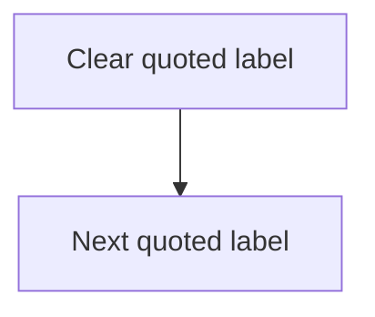

# NNScholar 2.4 Flowchart Design

This skill designs research diagrams. It prioritizes correctness, clarity, and editability over decoration. A diagram may be plain, but it must be logically faithful, cleanly organized, and unlikely to break when rendered.

Version: `0.2.0`. Stage: `research setting / flowchart design`. Legacy workflow alias: `$nnscholar2-4-flowchart-design`, routed through `$nnscholar-research-suite`.

## NNScholar Unified Operating Standard

This skill follows the shared NNScholar contract. If older local wording conflicts with this section, this section wins.

### Naming and Invocation

- Keep the workflow id, folder name, and legacy alias as `nnscholar2-4-flowchart-design` / `/nnscholar2-4-flowchart-design`.
- Keep the title format as `NNScholar 2.4 Flowchart Design`.
- Name generated folders and files with English ASCII kebab-case slugs, preferably `phase-step-yyyy-mm-dd-topic`, regardless of the report language.

### Input and Language Policy

- Accept free-form user input, upstream NNScholar outputs, local files, pasted tables, figures, reviewer comments, and target-venue instructions when relevant.
- For research planning, literature, experiment, figure/table planning, audits, and author-facing notes: output in the user's input language unless the user requests another language.
- For manuscript-facing text, including titles, abstracts, manuscript sections, figure legends, table titles/notes, cover letters, submission statements, and reviewer responses: default to polished academic English unless the user or target venue explicitly asks for Chinese, bilingual, or another language.
- Preserve identifiers in their standard form: database names, DOI/PMID/arXiv IDs, trial IDs, gene/protein symbols, chemical formulas, datasets, benchmarks, model names, scales, laws, policies, and citation keys.
- Search strings and database queries should normally be formulated in English, then explained in the output language.

### Multidisciplinary and Revision Standard

- First classify the discipline and study family: clinical medicine, biomedicine, AI/data science, materials/chemistry, education/psychology, economics/social science, humanities, engineering, or interdisciplinary.
- Use field-appropriate evidence, methods, reporting norms, and terminology. Do not force biomedical templates onto non-biomedical work.
- Every substantive output should include, when applicable: assumptions, missing information, author queries, risk/audit notes, and a revision-ready checklist.
- Do not fabricate citations, ethics approvals, registrations, sample sizes, statistics, experimental results, author declarations, or venue requirements. Mark uncertain items as `needs verification`.
- When revising or polishing, preserve scientific meaning, numeric values, methods, and claim strength unless the user supplies evidence and explicitly asks for a change.

## Core Rule

Do not redesign the research. Visualize the upstream logic. If `nnscholar2-2-ars-plan` or `nnscholar2-3-paper-architecture` exists, use them as the authority for study design, groups, variables, endpoints, methods, figures, and claims.

Use conservative Mermaid syntax by default. Prefer a detailed but simple flowchart over a clever diagram that may fail to render.

## Run Modes

| Mode | Trigger | Behavior |
|---|---|---|
| `protocol-linked` | Matching 2.2 ARS Plan exists | Draw study design, technical route, or analysis flow from protocol |
| `paper-linked` | Matching 2.3 Paper Architecture exists | Draw Figure 1 / graphical abstract / paper figure blueprint |
| `planning-linked` | Only 2.1 Research Planning exists | Draw task dependency, timeline, or milestone flow |
| `upstream-linked` | 1.1-1.4 outputs exist | Draw evidence-to-question-to-hypothesis-to-method route |
| `scratch` | Only a topic, idea, or hypothesis exists | Draw provisional concept flow and list missing design inputs |

If the request is vague, ask only:

1. What should the diagram be used for: paper Figure 1, protocol, grant, thesis, slides, or internal planning?
2. What diagram type is needed: study flow, technical route, data/model pipeline, mechanism map, PRISMA flow, or timeline?
3. Is there a 2.2 ARS Plan, 2.3 Paper Architecture, dataset, protocol, or draft to use?

## Upstream Priority

Use upstream sources in this order:

1. `nnscholar2-2-ars-plan`: design authority for protocol and technical route.
2. `nnscholar2-3-paper-architecture`: figure/table blueprint and target manuscript use.
3. `nnscholar2-1-research-planning`: milestones, tasks, dependencies, timeline.
4. `nnscholar1-3-hypothesis-generation`: mechanism and testable prediction.
5. `nnscholar1-2-literature-searching`: PRISMA/evidence map/method precedents.
6. `nnscholar1-1-question-mining`: question-to-gap-to-objective logic.
7. `nnscholar1-4-domain-expert-knowledge-base`: terminology, risk labels, reviewer cautions.
8. Current user input: latest diagram intent and constraints.

When files are not specified, search by skill id, topic keywords, disease/model/dataset, article type, method names, and report headings. Ask the user to choose if multiple bundles match.

## Diagram Type Selection

Pick the simplest diagram that answers the user's visual question:

- study flow / cohort flow;
- technical route;
- data-processing or model pipeline;
- experimental validation chain;
- mechanism/hypothesis map;
- PRISMA or evidence screening flow;
- conceptual framework or argument map;
- system architecture;
- timeline and milestone flow;
- graphical abstract / Figure 1 blueprint.

Load `references/diagram-patterns.md` when choosing discipline-specific patterns.

## Mermaid Safety Rules

Use `references/mermaid-style-guide.md` before producing Mermaid.

Default safe pattern:

Rules:

- Use ASCII node IDs only: `A1`, `DATA2`, `ANALYSIS3`.
- Put all visible labels in quotes inside brackets: `A1["Chinese or English label"]`.
- Do not put raw parentheses, slashes, colons, pipes, or commas directly in node IDs.
- Prefer `flowchart TD` or `flowchart LR`; avoid exotic Mermaid features unless necessary.
- Use subgraphs for detail, but keep subgraph IDs ASCII.
- Use ` ` for line breaks inside labels.
- Add a legend when arrow meaning could be confused.

When outputting a full report or writing a diagram to a file, run `scripts/validate_mermaid.py` on the Markdown if possible. If validation fails, simplify the diagram and validate again.

## Workflow

### Step 1: Diagram Intake

Extract:

- target use and audience;
- diagram type;
- upstream source and protocol status;
- discipline/article family;
- required entities, groups, decision points, outputs, and analysis steps;
- what the diagram must not imply.

Return a short diagram card before long output.

### Step 2: Build Blueprint

List:

- node groups or swimlanes;
- required nodes;
- required edges;
- decision points;
- labels and abbreviations;
- visual hierarchy;
- caption intent.

### Step 3: Produce Diagram

Output:

- clean Mermaid code block;
- optional caption;
- design notes;
- risks or missing inputs;
- revision questions.

For full reports, follow `references/flowchart-output-template.md`.

### Step 4: Check Meaning and Syntax

Before finalizing:

- check that arrows mean the correct thing;
- check that observational studies are not drawn like randomized trials;
- check that hypotheses are not drawn as proven mechanisms;
- check that AI benchmarks are not drawn as real-world clinical validation;
- check Mermaid syntax with `scripts/validate_mermaid.py` when practical.

## Arrow Semantics

Be explicit:

- time-order arrows do not mean causality;
- analysis-flow arrows do not mean biological mechanism;
- hypothesis arrows do not mean proven mechanism;
- cohort grouping arrows do not mean randomization unless randomization exists;
- evidence synthesis arrows do not mean primary data generation.

If there is risk of misreading, add a legend or use neutral labels such as `classified by`, `analyzed with`, `compared by`, or `hypothesized pathway`.

## Output Rules

Match the user's language. Keep scientific names, model names, datasets, variables, endpoints, trial IDs, citation keys, file paths, and software names in their original form.

Keep diagrams detailed but tidy. Use 6-18 nodes for a standard figure; use subgraphs when more detail is needed. If the diagram becomes too large, split into Figure 1A/1B or main diagram plus supplemental diagram.

Use `references/flowchart-test-cases.md` for regression examples.

## Non-goals

Do not:

- invent samples, variables, endpoints, cohorts, analyses, datasets, model steps, or results;
- change a locked 2.2 protocol or 2.3 figure blueprint;
- generate decorative-only graphics;
- create misleading causal arrows;
- produce complex Mermaid syntax if a simple flowchart can express the idea safely.
